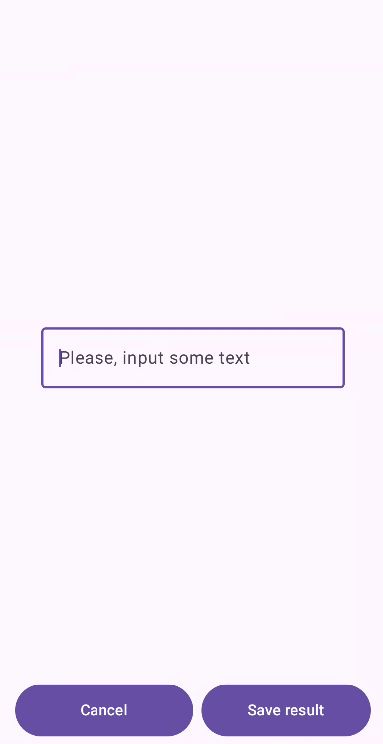
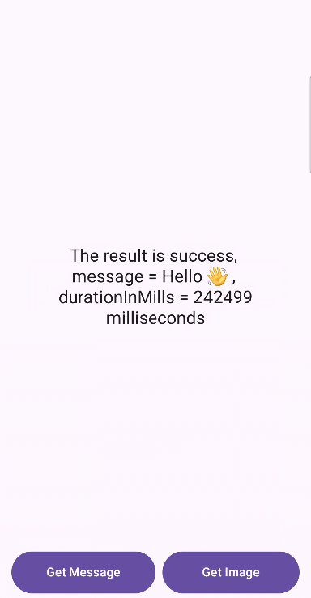

# Feature interaction example

This Repository is an example of multi-module interaction.

## How does it work?

This solution based on [ActivityResultApi](https://developer.android.com/training/basics/intents/result). There are ActivityProvider that monitors ths active Activity and FeatureManager that launches our feature using ActivityResultApi and provides the result. Also, FeatureManager handles configuration changes and shuts down correctly to prevent memory-leaks.

Base interface for all feature-modules looks like this:

```kotlin
interface FeatureManager {

    @MainThread
    fun <I, O> launch(
        key: String,
        contract: ActivityResultContract<I, O>,
        input: I,
        output: (FeatureResult<O>) -> Unit
    )
}
```
You can create your own contract in any way that suits you. In this example each feature-module implements own contract that depending on the needs.

```kotlin
interface SomeFeature {

    @MainThread
    fun launchSomeFeature(
        input: SomeFeatureArgs,
        onSuccess: (result: SomeFeatureResult.Success, durationInMills: Long) -> Unit = { _, _ -> },
        onFailure: (result: SomeFeatureResult.Failure, durationInMills: Long) -> Unit = { _, _ -> },
        onCancelled: (durationInMills: Long) -> Unit = {  }
    )

    ...
}
```

And further usage looks something like this in your ViewModel or somewhere else.

```kotlin
    someFeature.launchSomeFeature(
        input = SomeFeatureArgs("Please, input some text"),
        onSuccess = { 
            // do something
        },
        onFailure = { 
            // do something
        },
        onCancelled = { 
            // do something
        }
    )
```

# Example of interaction

Below are the screenshots of example app. 

Screen of feature module where we can input text is presented below:



After we entered the text and clicked on "Save result", we return to the main screen and see it. 

